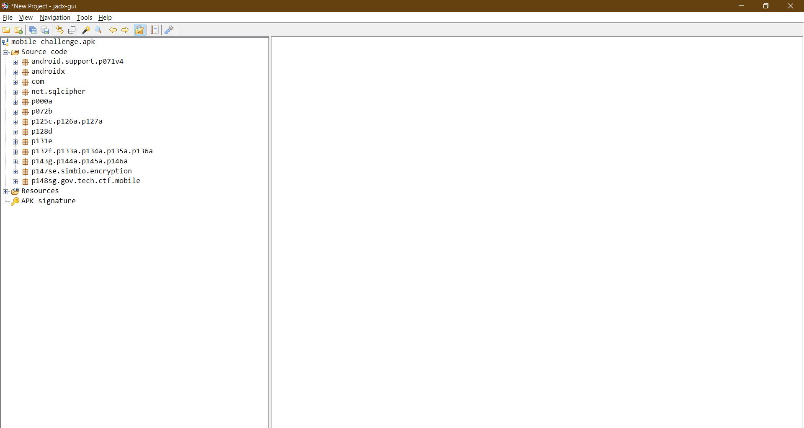
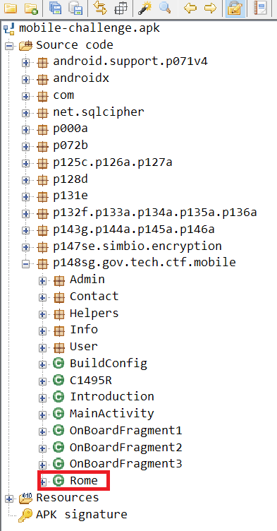
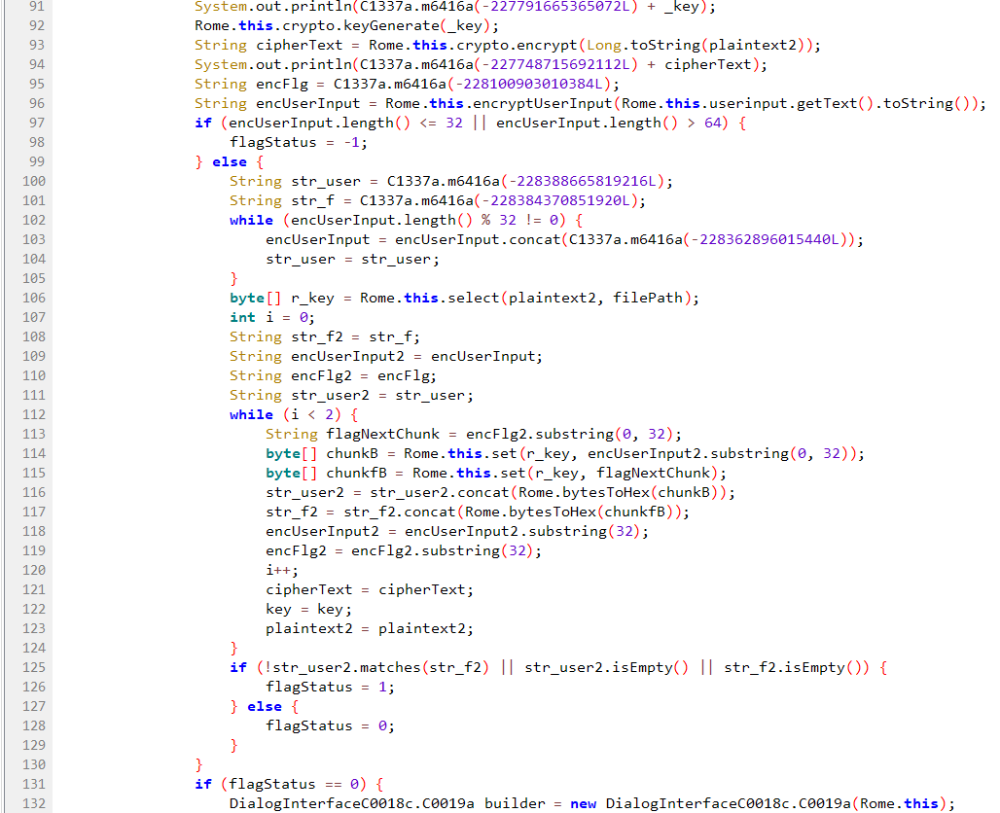
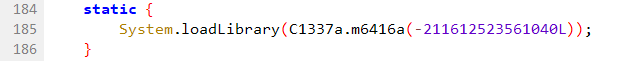
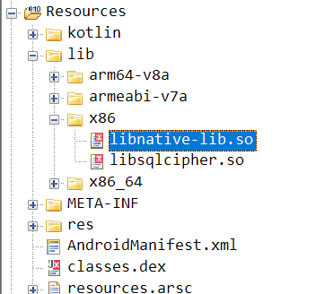
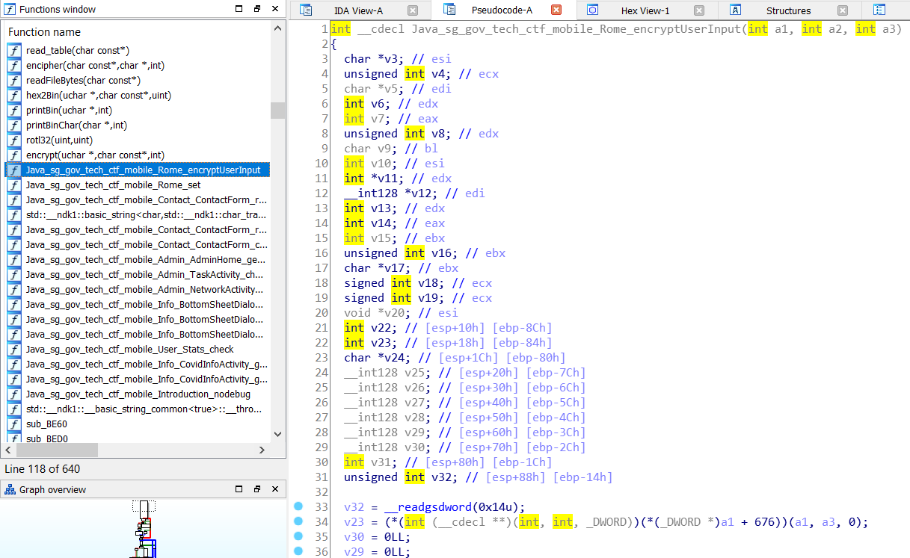
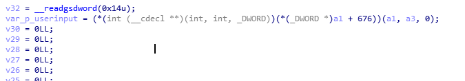
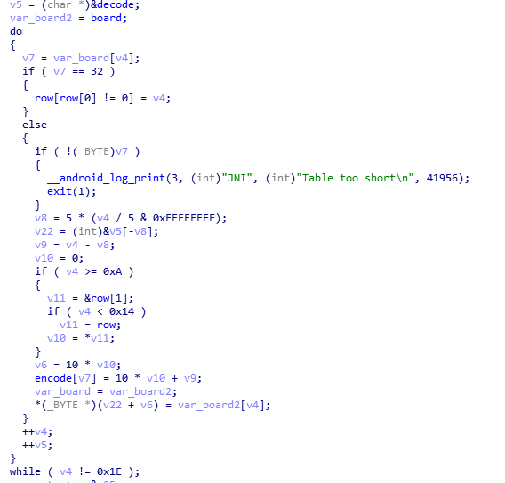
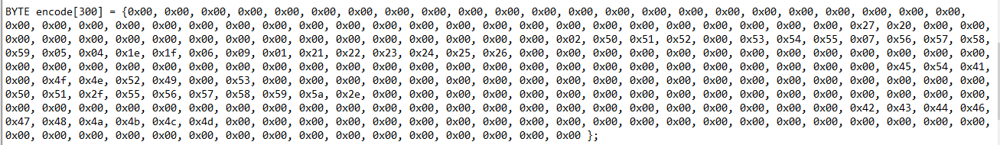
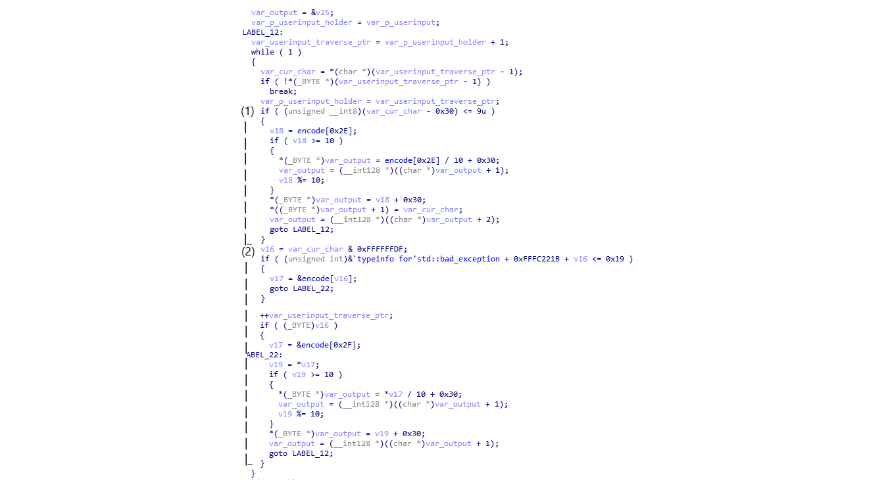

# All Roads Lead to Rome! - STACK the Flags 2020 writeup

## Challenge info

**TITLE**

All Roads Lead to Rome! [3000 points]

**CATEGORY**

Mobile

**DESCRIPTION**

> Korovax wants everyone to reach this Activity, because Korovax recently read up on Rome and would like to share with everyone else! It's Korovax's application and he can do whatever he wants! Perhaps we can find the secrets of Korovax through Rome?

An APK file `mobile-challenge.apk` is provided as part of the challenge.

## Contents

- [Introduction](#introduction)
- [Decompiling the app](#decompiling-the-app)
- [Analyzing the Java code](#analyzing-the-java-code)
- [Locating the native library](#locating-the-native-library)
- [Decompiling the native library](#decompiling-the-native-library)
- [Analyzing the native code](#analyzing-the-native-code)
- [Retrieving the encode table](#retrieving-the-encode-table)
- [Understanding the encoding algorithm](#understanding-the-encoding-algorithm)
- [Decoding the flag](#decoding-the-flag)
- [Conclusion](#conclusion)

## Introduction

This challenge is solved using both static and dynamic analysis. This involves using decompilation tools for static analysis and debuggers and emulators for dynamic analysis.

The challenge description tells us that we are looking for something related to an Activity and Rome. We will keep this in mind.

## Decompiling the app

One of the first things we try is decompiling the APK. We use [jadx](https://github.com/skylot/jadx) which even comes with a GUI. Simply install the program, run it, and select the APK file `mobile-challenge.apk` for decompilation.



`jadx` smoothly decompiles the APK file into Java code. Now, we begin analyzing the code.

## Analyzing the Java code

We notice an Activity called `Rome` after poking around the code. This Activity is directly related to the challenge!



Looking through the source code of the `Rome` Activity, we find the main function which validates the user input - `onClick(View)`. Looking even deeper, we find the main part of the challenge.



### Important notes

- Line 131: the goal is to find a user input that results in `flagStatus == 0`.
- Line 96: the app encodes the user input by calling the JNI function `encryptUserInput(String)`.
- Lines 97, 102, 113, 114: the encoded user input `encUserInput` should be of length 32. After analyzing the function `encryptUserInput(String)`, we realise that this is also the length of the original user input.
- Lines 108-129: the encoded user input `encUserInput` needs to be equal to the encoded flag `encFlag`.

Lastly, line 108: the encoded flag `encFlag` is determined by the function `C1337a.m6416a(long)`. By manually copying and executing the code relevant to that function in [repl.it](https://repl.it/), we find that `encFlag == "8443410818532819843239113959333039368139089308839181213938232000"`.

For convenience, we represent `encFlag` in hexadecimal notation like so:

```text
38 34 34 33 34 31 30 38 31 38 35 33 32 38 31 39 38 34 33 32 33 39 31 31 33 39 35 39 33 33 33 30 33 39 33 36 38 31 33 39 30 38 39 33 30 38 38 33 39 31 38 31 32 31 33 39 33 38 32 33 32 30 30 30
```

### Summary of the Java code

In summary, this is the gist of the code:

```text
var encFlag = getEncFlag() // line 108
var encUserInput = encryptUserInput(UserInput) // line 96

set(key, encFlag) // line 114
set(key, encUserInput) // line 115
compare(encFlag, encUserInput) // line 126
```

Note that `set()` is a JNI function.

There is one possible issue with our summary of the code. Based on line 112, `set()` is called twice on the encoded flag and input. The issue is that `set()` may use a key scheduling or mutation algorithm which would cause different results. However, after analyzing the native implementation for `set()` later on, we conclude that it does not maintain internal states. Hence, this scenario is unlikely.

In conclusion, it is clear that the crucial function is `encryptUserInput(String)`. All we need to do now is analyze that function and find a user input that matches `encFlag`.

## Locating the native library

As with the previous mobile challenges, the important function `encryptUserInput(String)` is implemented in the C++ shared library.



Using the code we copied into [repl.it](https://repl.it) earlier, we find that `C1337a.m6416a(-211612523561040L)` resolves to `libnative-lib.so`. This is the library we're looking for.

Looking around the `jadx-gui` output, we easily find the location of that library.



## Decompiling the native library

We use [IDA Pro](https://www.hex-rays.com/products/ida/) to decompile the `libnative-lib.so`. Free decompilers like [Ghidra](https://ghidra-sre.org/) will likely work just as well.

We also decompile the x86 variant of the library as it matches the architecture of the emulator we will use later on for debugging.

Looking through the decompiler output, we find the function `Java_sg_gov_tech_ctf_mobile_Rome_encryptUserInput()`, which is the implementation of the function `encryptUserInput(String)`.



## Analyzing the native code

Similar to the functions related to the other mobile challenges, the first line of this function gets the user input.



After renaming some variables for clarity, we quickly discover a chunk of code that is unaffected by the user input.



We realize 2 things:

- `encode` is in the [.bss segment](https://en.wikipedia.org/wiki/.bss) which contains uninitialized global variables.
- `board` stores a pointer to the [.rodata segment](https://en.wikipedia.org/wiki/Data_segment) which contains constants.

The code is actually building an encode table from the fixed array of data `board`! We need to find out the contents of the encode table.

## Retrieving the encode table

To retrieve the encode table from memory, we need to do the following:

1. Set up an emulator
2. Run the `Rome` Activity on the emulator
3. Attach a debugger to the app process
4. Dump the values stored at the memory address of the encode table.

This is how we go about accomplishing the steps:

1. [Start the emulator](https://developer.android.com/studio/run/emulator-commandline).
2. Install the APK file on it with the command: `adb install mobile-challenge.apk`
3. Start the `Rome` Activity with the command: `adb shell am start sg.gov.tech.ctf.mobile/.Rome`
4. Attaching the debugger is more involved:
   1. Find the process ID of the running app with the command: `adb shell ps | grep sg.gov.tech.ctf.mobile`
   2. Attach a [gdbserver](https://sourceware.org/gdb/current/onlinedocs/gdb/Server.html) instance to the process with the command: `adb shell "gdbserver attach :8888 --attach <process ID of app>`
   3. Forward the port that the `gdbserver` is listening on with the command: `adb forward tcp:8888 tcp:8888`
   4. Start [GDB](https://www.gnu.org/software/gdb/) with the command: `gdb`
   5. Disable automatic symbol loads with the command: `set auto-solib-add off`. These are time-consuming and may hang.
   6. Connect to the listening port with the command: `target remote :8888`
5. Find the base memory address of the `libnative-lib.so` library with the command: `adb shell cat/proc/<process ID of app>/maps | grep libnative-lib`
6. Place a breakpoint at the memory address `0xa501`, which is right after the loop which populates the encode table.
7. Step through the program and print out the values starting at the memory address `0x3e0cc`, which is the start of the encode table.

After printing, we get the following table:


Since `board` is constant, the encode table must be constant. This means that the encode table will remain the same no matter what. Knowing this, we can move on to understanding how the encoding works.

## Understanding the encoding algorithm

With the encode table ready, it is time to reverse engineer the main encoding algorithm.

After renaming a few more variables for clarity, we end up with the following decompiler output.



The algorithm iterates through each character of the user input and encodes each character. The characters of the resulting string will all be less than `0x40`. In this case, they are all in the range `0x30` through `0x39`.

There are 2 possible cases for a character:

1. The character < 0x40 (refer to the code in (1) in the image above)

   Since `v18` takes the value of `encode[0x2e]`, which is `0x20` based on the dumped encode table, the if statement `if (v18 >= 10)` will always be true.

   Hence, the encoded character will always be in the form `0x32, 0x33, <char>`. The single-byte character will encode to 3 bytes.

2. The character >= 0x40 (refer the code in (2) in the image above)

   If `v19 >= 10` the character encodes to 2 bytes. Otherwise, it encodes to only 1 byte.

Notice that the algorithm uses variable length encoding. This is possibly why there is no user input length validation in the function unlike the other mobile challenges.

### Decoding the flag

Initially, we tried several methods to decode the flag such as [angr](http://angr.io/) and [AFL](https://github.com/google/AFL). Both methods did not work.

We end up enumerating every character to generate an encoding table so that we can manually decode the flag. To do so, we write a C program that replicates the encoding algorithm.

```c
#include <stdlib.h>
#include <stdio.h>
#include <stdint.h>
#include <memory.h>

typedef uint8_t BYTE;
typedef uint32_t DWORD;

// This is the encode table from earlier.
BYTE encode[300] = { 0x00, 0x00, 0x00, 0x00, 0x00, 0x00, 0x00, 0x00, 0x00, 0x00, 0x00, 0x00, 0x00, 0x00, 0x00, 0x00, 0x00, 0x00, 0x00, 0x00, 0x00, 0x00, 0x00, 0x00, 0x00, 0x00, 0x00, 0x00, 0x00, 0x00, 0x00, 0x00, 0x00, 0x00, 0x00, 0x00, 0x00, 0x00, 0x00, 0x00, 0x00, 0x00, 0x00, 0x00, 0x00, 0x00, 0x27, 0x20, 0x00, 0x00, 0x00, 0x00, 0x00, 0x00, 0x00, 0x00, 0x00, 0x00, 0x00, 0x00, 0x00, 0x00, 0x00, 0x00, 0x00, 0x02, 0x50, 0x51, 0x52, 0x00, 0x53, 0x54, 0x55, 0x07, 0x56, 0x57, 0x58, 0x59, 0x05, 0x04, 0x1e, 0x1f, 0x06, 0x09, 0x01, 0x21, 0x22, 0x23, 0x24, 0x25, 0x26, 0x00, 0x00, 0x00, 0x00, 0x00, 0x00, 0x00, 0x00, 0x00, 0x00, 0x00, 0x00, 0x00, 0x00, 0x00, 0x00, 0x00, 0x00, 0x00, 0x00, 0x00, 0x00, 0x00, 0x00, 0x00, 0x00, 0x00, 0x00, 0x00, 0x00, 0x00, 0x00, 0x00, 0x00, 0x00, 0x00, 0x00, 0x45, 0x54, 0x41, 0x00, 0x4f, 0x4e, 0x52, 0x49, 0x00, 0x53, 0x00, 0x00, 0x00, 0x00, 0x00, 0x00, 0x00, 0x00, 0x00, 0x00, 0x00, 0x00, 0x00, 0x00, 0x00, 0x00, 0x00, 0x00, 0x00, 0x00, 0x50, 0x51, 0x2f, 0x55, 0x56, 0x57, 0x58, 0x59, 0x5a, 0x2e, 0x00, 0x00, 0x00, 0x00, 0x00, 0x00, 0x00, 0x00, 0x00, 0x00, 0x00, 0x00, 0x00, 0x00, 0x00, 0x00, 0x00, 0x00, 0x00, 0x00, 0x00, 0x00, 0x00, 0x00, 0x00, 0x00, 0x00, 0x00, 0x00, 0x00, 0x00, 0x00, 0x00, 0x00, 0x00, 0x00, 0x00, 0x00, 0x00, 0x00, 0x42, 0x43, 0x44, 0x46, 0x47, 0x48, 0x4a, 0x4b, 0x4c, 0x4d, 0x00, 0x00, 0x00, 0x00, 0x00, 0x00, 0x00, 0x00, 0x00, 0x00, 0x00, 0x00, 0x00, 0x00, 0x00, 0x00, 0x00, 0x00, 0x00, 0x00, 0x00, 0x00, 0x00, 0x00, 0x00, 0x00, 0x00, 0x00, 0x00, 0x00, 0x00, 0x00, 0x00, 0x00, 0x00, 0x00, 0x00 };

// This is the `encFlag` from earlier.
BYTE target[65] = { 0x38, 0x34, 0x34, 0x33, 0x34, 0x31, 0x30, 0x38, 0x31, 0x38, 0x35, 0x33, 0x32, 0x38, 0x31, 0x39, 0x38, 0x34, 0x33, 0x32, 0x33, 0x39, 0x31, 0x31, 0x33, 0x39, 0x35, 0x39, 0x33, 0x33, 0x33, 0x30, 0x33, 0x39, 0x33, 0x36, 0x38, 0x31, 0x33, 0x39, 0x30, 0x38, 0x39, 0x33, 0x30, 0x38, 0x38, 0x33, 0x39, 0x31, 0x38, 0x31, 0x32, 0x31, 0x33, 0x39, 0x33, 0x38, 0x32, 0x33, 0x32, 0x30, 0x30, 0x30, 0x00 };

void crypt(BYTE c, BYTE *output) {
    memset(output, 0, 3);
    BYTE *origpos = output;
    memset(output, 0, 0x10);
    if (c - 0x30 <= 0x9) {
        BYTE v18 = encode[0x2e];
        if (v18 >= 10) {
            *output = encode[0x2e] / 10 + 0x30;
            output = output + 1;
            v18 %= 10;
        }
        *output = v18 + 0x30;
        *(output + 1) = c;
        output = output + 2;
        return;
    }
    BYTE v16 = c & 0xDF;
    if (v16) {
        BYTE *v17;
        if ((0xbf + v16) % 0xff <= 0x19) {
            v17 = &encode[v16];
        } else {
            v17 = &encode[0x2f];
        }
        BYTE v19 = *v17;
        if (v19 >= 10) {
            *output = *v17 / 10 + 0x30;
            output = output + 1;
            v19 %= 10;
        }
        *output = v19 + 0x30;
        output = output + 1;
        return;
    }
}

void print_hex(BYTE str[], int len) {
    int idx;
    for (idx = 0; idx < len; idx++)
        printf("0x%02x ", str[idx]);
}

void main() {
    BYTE *output = (BYTE *)malloc(0x10);
    for (int i = 0x20; i < 0x7f; i++) {
        printf("encode %c :", i);
        crypt((BYTE)i, output);
        print_hex(output, 3);
        puts("");
    }
    free(output);
}
```

We obtain the following table after running the program.

```text
encode   :0x33 0x39 0x20
encode ! :0x33 0x39 0x21
encode " :0x33 0x39 0x22
encode # :0x33 0x39 0x23
encode $ :0x33 0x39 0x24
encode % :0x33 0x39 0x25
encode & :0x33 0x39 0x26
encode ' :0x33 0x39 0x27
encode ( :0x33 0x39 0x28
encode ) :0x33 0x39 0x29
encode * :0x33 0x39 0x2a
encode + :0x33 0x39 0x2b
encode , :0x33 0x39 0x2c
encode - :0x33 0x39 0x2d
encode . :0x33 0x39 0x2e
encode / :0x33 0x39 0x2f
encode 0 :0x33 0x39 0x30
encode 1 :0x33 0x39 0x31
encode 2 :0x33 0x39 0x32
encode 3 :0x33 0x39 0x33
encode 4 :0x33 0x39 0x34
encode 5 :0x33 0x39 0x35
encode 6 :0x33 0x39 0x36
encode 7 :0x33 0x39 0x37
encode 8 :0x33 0x39 0x38
encode 9 :0x33 0x39 0x39
encode : :0x33 0x32 0x00
encode ; :0x33 0x32 0x00
encode < :0x33 0x32 0x00
encode = :0x33 0x32 0x00
encode > :0x33 0x32 0x00
encode ? :0x33 0x32 0x00
encode @ :0x30 0x00 0x00
encode A :0x32 0x00 0x00
encode B :0x38 0x30 0x00
encode C :0x38 0x31 0x00
encode D :0x38 0x32 0x00
encode E :0x30 0x00 0x00
encode F :0x38 0x33 0x00
encode G :0x38 0x34 0x00
encode H :0x38 0x35 0x00
encode I :0x37 0x00 0x00
encode J :0x38 0x36 0x00
encode K :0x38 0x37 0x00
encode L :0x38 0x38 0x00
encode M :0x38 0x39 0x00
encode N :0x35 0x00 0x00
encode O :0x34 0x00 0x00
encode P :0x33 0x30 0x00
encode Q :0x33 0x31 0x00
encode R :0x36 0x00 0x00
encode S :0x39 0x00 0x00
encode T :0x31 0x00 0x00
encode U :0x33 0x33 0x00
encode V :0x33 0x34 0x00
encode W :0x33 0x35 0x00
encode X :0x33 0x36 0x00
encode Y :0x33 0x37 0x00
encode Z :0x33 0x32 0x00
encode [ :0x33 0x32 0x00
encode \ :0x33 0x32 0x00
encode ] :0x33 0x32 0x00
encode ^ :0x33 0x32 0x00
encode _ :0x33 0x32 0x00
encode ` :0x30 0x00 0x00
encode a :0x32 0x00 0x00
encode b :0x38 0x30 0x00
encode c :0x38 0x31 0x00
encode d :0x38 0x32 0x00
encode e :0x30 0x00 0x00
encode f :0x38 0x33 0x00
encode g :0x38 0x34 0x00
encode h :0x38 0x35 0x00
encode i :0x37 0x00 0x00
encode j :0x38 0x36 0x00
encode k :0x38 0x37 0x00
encode l :0x38 0x38 0x00
encode m :0x38 0x39 0x00
encode n :0x35 0x00 0x00
encode o :0x34 0x00 0x00
encode p :0x33 0x30 0x00
encode q :0x33 0x31 0x00
encode r :0x36 0x00 0x00
encode s :0x39 0x00 0x00
encode t :0x31 0x00 0x00
encode u :0x33 0x33 0x00
encode v :0x33 0x34 0x00
encode w :0x33 0x35 0x00
encode x :0x33 0x36 0x00
encode y :0x33 0x37 0x00
encode z :0x33 0x32 0x00
encode { :0x33 0x32 0x00
encode | :0x33 0x32 0x00
encode } :0x33 0x32 0x00
encode ~ :0x33 0x32 0x00
```

Notice that there are multiple characters that encode to the same characters. It is unclear whether this is intentional, or whether there are additional checks, or whether the input is preprocessed.

Regardless, this table is enough to decode the flag (along with some educated guesses 😉). Replace each byte sequence in `encFlag` with the appropriate character. We get the flag: `govtech_csg{1t5sup3rc0mpl1cat3d}`.

While this flag passes validation in the app, it is not the correct flag. Upon clarifying with an admin, we realise that the flag is actually capitalized. With a few edits, we end up with the correct flag: `govtech-csg{1T5SUP3RC0MPL1CAT3D}`.

Note: the correct flag may, in fact, have underscores like so: `govtech-csg{1T5_SUP3R_C0MPL1CAT3D}`. We may have forgotten which is the correct flag 😅

## Conclusion

All in all, we feel that this is an interesting challenge involving both reverse engineering and debugging Java and C code. Thanks to GovTech CSG for the challenge! 😁
